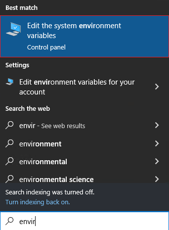
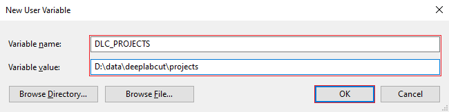

# Configuration

This section covers how to configure the software to support your environment once the
backend has been downloaded. The backend can be configured in two ways, using
environment variables, however, is preferred for more permanent installations.

## Options

With each setup method, you are able to configure the following variables.

| Option       | Description                                                                                                                                                                                                                                                                                       | Default                             |
| ------------ | ------------------------------------------------------------------------------------------------------------------------------------------------------------------------------------------------------------------------------------------------------------------------------------------------- | ----------------------------------- |
| Projects     | The file system path to the directory containing your DeepLabCut projects.                                                                                                                                                                                                                        | `#!python "backend/tests/testdata"` |
| Frame Format | The Python formatting string that dictates how the filename is derived from the frame number.                                                                                                                                                                                                     | `#!python "img{:04}.png"`           |
| Token        | An access token used to protect the backend from unauthorised access, it should only be shared with authorised parties and should be used alongside HTTPS encryption. For more advanced authentication strategies a third-party software such as [Authelia](https://authelia.com) should be used. | `#!python None`                     |
| Host         | The address the webserver is bound to, defaults to local machine only, set to `#!python 0.0.0.0` to allow access from the local network.                                                                                                                                                          | `#!python "127.0.0.1"`              |
| Port         | The port the webserver is bound to, this may need to be changed to avoid conflicts with other software that is may already be using that port.                                                                                                                                                    | `#!python 8000`                     |
| SSL Certfile | The SSL certificate file                                                                                                                                                                                                                                                                          | `#!python None`                     |
| SSL Keyfile  | The SSL certificates private key file                                                                                                                                                                                                                                                             | `#!python None`                     |

## Using Command-line Arguments

Open a terminal and navigate to the location of the downloaded binary, on Windows you can use
the Command Prompt or PowerShell, then to see a list of the available command-line arguments
run `./<binary> --help`, replace `<binary>` with the name of the executable file you
downloaded, for Windows users this should be `dlc-webui.exe`.
The main argument you need to configure is `--projects`, which as mentioned in the table
above should point to the location where your DeepLabCut projects are stored.
All options can be configured using command-line arguments. To derive the command line
argument name, convert the name to lowercase, replace spaces with dashes, and add the prefix
`--`.

<div style="text-align: center" markdown>
Frame Format :material-arrow-right: `frame-format` :material-arrow-right: `--frame-format`
</div>

The other options converted to command-line arguments are `--projects`, `--token`, `--host`, `--port`, `--ssl-certfile`, and `--ssl-keyfile`.

Below are some examples of how to run and configure the backend using command line
arguments.

```c title="Show help message"
$ .\dlc-webui.exe --help

usage: dlc-webui [-h] [--projects PATH] [--frame-format FORMAT] [--host HOST] [--port PORT] [--token TOKEN]
                 [--ssl-certfile PATH] [--ssl-keyfile PATH]

options:
  -h, --help            show this help message and exit
  --projects PATH       path to directory containing your DLC projects
  --frame-format FORMAT
                        formatting string for the name of extracted frames (default: img{:04}.png)
  --host HOST           bind the server to this address (default: 127.0.0.1)
  --port PORT           bind the server to this port (default: 8000)
  --token TOKEN         token used to secure the backend from unauthorised access
  --ssl-certfile PATH   path to SSL certificate
  --ssl-keyfile PATH    path to SSL certificates private key
```

```python title="Using multiple arguments"
.\dlc-webui.exe --host 0.0.0.0 --port 9292 --projects '/path/to/projects'
```

## Using Environment Variables

Environment variables can be configured in two ways, they can be configured globally on a
system level, or with a `.env` file located next to the binary.
All options can be configured using environment variables. To derive the environment variable
name, convert the name to uppercase, replace spaces with underscores, and add the prefix
`DLC_`.

<div style="text-align: center" markdown>
Frame Format :material-arrow-right: `FRAME_FORMAT` :material-arrow-right: `DLC_FRAME_FORMAT`
</div>

The other options converted to environment variables are `DLC_PROJECTS`, `DLC_TOKEN`,
`DLC_HOST`, `DLC_PORT`, `DLC_SSL_CERTFILE`, and `DLC_SSL_KEYFILE`.

### Configure with Windows

<div style="display: flow-root" markdown>
{ align=right }

First, you will need to open the windows search, and search
for "environment", then select the entry called "edit the
system environment variables"

</div>

<div style="display: flow-root" markdown>
{ align=right }

In the next window click the button called "Environment
Variables”

</div>

<div style="display: flow-root" markdown>
{ align=right width=409 }

It will then show you a window with all the currently
declared environment variables, click the “New…”
button to create a new environment variable.

</div>

Finally, you will be presented with a dialog
where you can enter the name of the
environment variable and the value you want
to assign.

<figure markdown>

</figure>

### Configure with a .env file

To use the dotenv file method you will need to create a file named `.env` next to the
executable used to run the backend. Open the file with your preferred editor, notepad is
sufficient, and add the environment variables you want to configure. A sample file is distributed
with the source code, containing the following. See this [source](https://hexdocs.pm/dotenvy/dotenv-file-format.html) for more information on the
format of dotenv files. This file takes precedence over globally configured environment
variables.

```python title="Example .env file"
# The file system path to the directory containing
# your DeepLabCut projects.
DLC_PROJECTS="/path/to/projects"

# The Python formatting string that dictates how the
# filename is derived from the frame number.
DLC_FRAME_FORMAT="img{:04}.test.png"
```

```ini title="Sample .env file bundled with the executable"
--8<-- ".env.sample"
```
